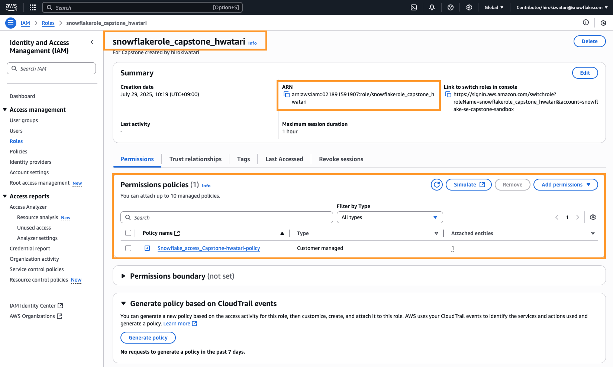

# SnowflakeとS3のストレージ統合設定ガイド

このリポジトリは、SnowflakeとAmazon S3を連携させるためのストレージ統合（Storage Integration）の設定手順とサンプルコードをまとめたものです。
ストレージ統合を利用することで、AWSのアクセスキーやシークレットキーをSnowflakeに直接設定することなく、安全にS3バケットへのアクセスが可能になります。

## 概要

Snowflakeから外部のS3ステージにあるデータを読み書きするために、ストレージ統合を利用します。
これにより、認証情報をSnowflakeに渡す必要がなくなり、セキュリティが向上します。

### 統合のフロー


1.  **外部ステージ**: 認証のためにストレージ統合オブジェクトを参照します。
2.  **Snowflake**: S3バケットにアクセスするための専用IAMユーザーを内部で作成します。
3.  **AWS**: 管理者は、そのIAMユーザーに対して、指定されたS3バケットへのアクセス権限をIAMロールとポリシーを通じて付与します。

---
## セットアップ手順

設定は、大きく分けてAWS側とSnowflake側の2つのステップで構成されます。

### ステップ1: AWSでの設定 (IAMポリシーとロールの作成)

まず、AWSコンソールでSnowflakeからのアクセスを許可するためのIAMポリシーとIAMロールを作成します。

#### 1. IAMポリシーの作成

Snowflakeが必要とするS3へのアクセス権限を定義したIAMポリシーを作成します。

- **必要な権限の例:**
  - `s3:GetBucketLocation`
  - `s3:GetObject`
  - `s3:GetObjectVersion`
  - `s3:ListBucket`
  - `s3:PutObject` (アンロード時に必要)
  - `s3:DeleteObject` (REMOVE実行時に必要)

- **ポリシーJSONのサンプル:**
  `YOUR_BUCKET_NAME` や `YOUR_PATH` の部分は、ご自身の環境に合わせて変更してください。

```json
{
    "Version": "2012-10-17",
    "Statement": [
        {
            "Effect": "Allow",
            "Action": [
                "s3:PutObject",
                "s3:GetObject",
                "s3:GetObjectVersion",
                "s3:DeleteObject",
                "s3:DeleteObjectVersion"
            ],
            "Resource": "arn:aws:s3:::aaaaaaaaa/*"
        },
        {
            "Effect": "Allow",
            "Action": [
                "s3:ListBucket",
                "s3:GetBucketLocation"
            ],
            "Resource": "arn:aws:s3:::aaaaaaaa-hwatari",
            "Condition": {
                "StringLike": {
                    "s3:prefix": [
                        "*"
                    ]
                }
            }
        }
    ]
}
```

#### 2. IAMロールの作成

作成したIAMポリシーをアタッチするIAMロールを作成します。この際、信頼されたエンティティとして、後ほどSnowflake側で作成するIAMユーザーを指定する必要があります（この時点ではプレースホルダーで作成し、後で更新します）。

作成したポリシーをアタッチするためのAWSのロールの作成を行う。
作成方法に関しては[ドキュメント](https://docs.snowflake.com/en/user-guide/data-load-s3-config-storage-integration)を参照、作成結果は下記の通り。
- ロール名：`snowflakerole_aaaaaaaa_hwatari`
- 概要：↓



---

### ステップ2: Snowflakeでの設定

次に、SnowflakeのワークシートでSQLを実行し、ストレージ統合と外部ステージを作成します。
詳細なコードは `s3strage_integration.ipynb` を参照してください。

#### 1. ストレージ統合の作成

`CREATE STORAGE INTEGRATION` コマンドで、S3への接続情報を定義します。`STORAGE_AWS_ROLE_ARN` にはステップ1で作成したIAMロールのARNを、`STORAGE_ALLOWED_LOCATIONS` にはアクセスを許可するS3バケットを指定します。

```sql
CREATE or replace STORAGE INTEGRATION aaaaaaaa_s3_integration
  TYPE = EXTERNAL_STAGE
  STORAGE_PROVIDER = 'S3'
  ENABLED = TRUE
  STORAGE_AWS_ROLE_ARN = 'arn:aws:iam::021891591907:role/snowflakerole_aaaaaaaa_hwatari'
  STORAGE_ALLOWED_LOCATIONS = ('s3://aaaaaaaa-hwatari/')
```

#### 2. SnowflakeのIAMユーザー情報を取得

`DESCRIBE INTEGRATION` コマンドを実行して、Snowflakeが自動生成したIAMユーザーのARN (`STORAGE_AWS_IAM_USER_ARN`) と外部ID (`STORAGE_AWS_EXTERNAL_ID`) を取得します。

```sql
DESC INTEGRATION aaaaaaaa_s3_integration;
```

#### 3. AWS IAMロールの信頼関係を更新

ステップ1で作成したIAMロールに戻り、「信頼関係」を編集します。プリンシパル（Principal）にステップ2で取得した `STORAGE_AWS_IAM_USER_ARN` を設定し、`Condition` に `STORAGE_AWS_EXTERNAL_ID` を追加します。

```json
{
    "Version": "2012-10-17",
    "Statement": [
        {
            "Effect": "Allow",
            "Principal": {
                "AWS": "arn:aws:iam::392051336358:user/3r201000-s"
            },
            "Action": "sts:AssumeRole",
            "Condition": {
                "StringEquals": {
                    "sts:ExternalId": "HU05376_SFCRole=7_l0cW1Ki71pU8t9bVpy2QZnPclME="
                }
            }
        }
    ]
}
```

#### 4. 外部ステージの作成

最後に、作成したストレージ統合を利用して外部ステージを作成します。

```sql
USE SCHEMA aaaaaaaa.public;

CREATE or replace STAGE aaaaaaaa_s3_stage
  STORAGE_INTEGRATION = aaaaaaaa_s3_integration
  URL = 's3://aaaaaaaa-hwatari/'
```

これで、SnowflakeからS3バケットへ安全にアクセスする準備が整いました。

---

## 参考資料

- [Configuring Secure Access to Amazon S3 — Snowflake Documentation](https://docs.snowflake.com/en/user-guide/data-load-s3-config-storage-integration)
